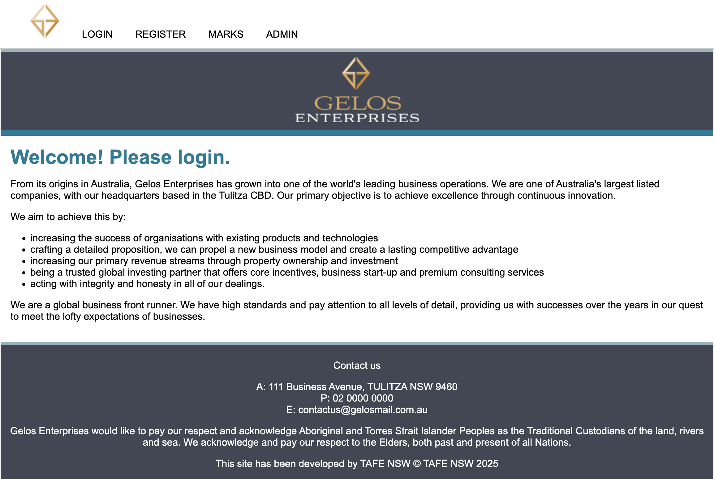
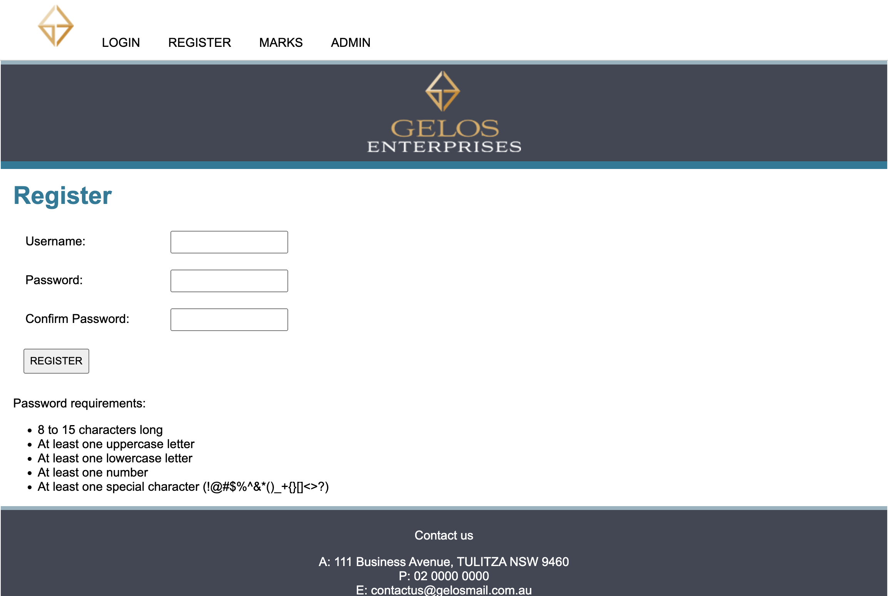
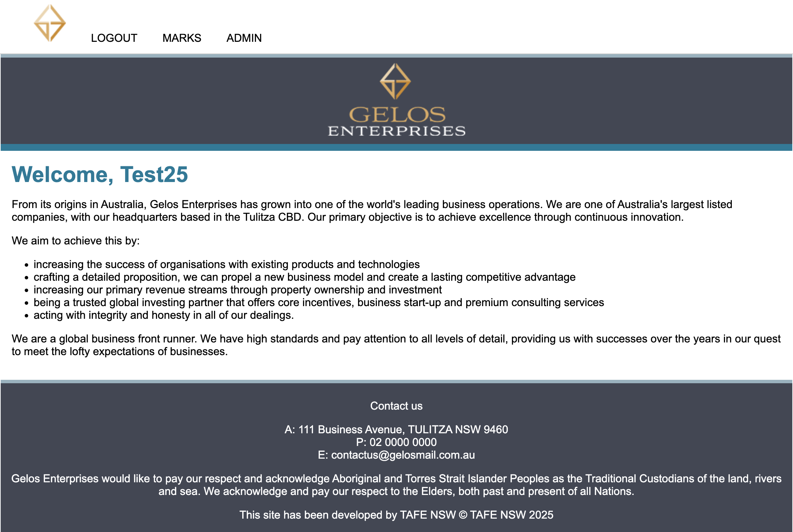
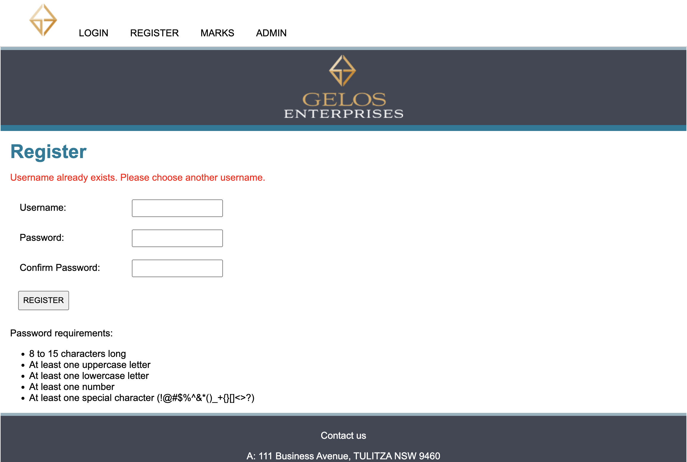
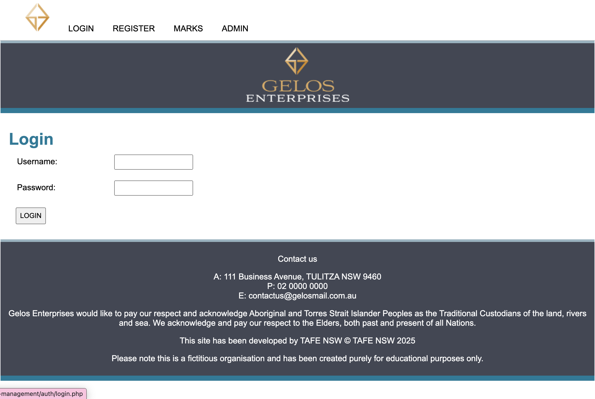
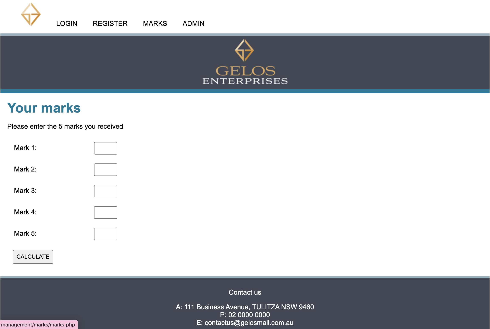
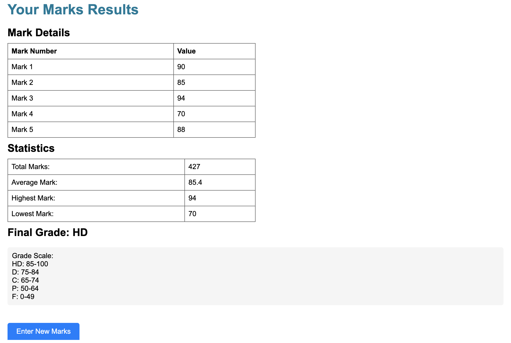

# Gelos Member Management System

## 🎯 Project Overview
A comprehensive web-based member management system for Gelos Enterprises, demonstrating proficiency in full-stack web development. This project showcases practical implementation of user authentication, role-based access control, and data management using PHP and web technologies.

## 📸 Features & Screenshots

### Home Page & Navigation

*Clean and professional landing page with intuitive navigation*

### User Authentication
#### Registration System

*Secure registration form with password requirements*

*Real-time password validation and requirements display*

*Successful registration with welcome message*

*Error handling for existing username or invalid input*

#### Login Interface

*User-friendly login interface with error handling*

### Marks Management
#### Input Interface

*Easy-to-use marks entry system*

#### Results Display

*Comprehensive results display with statistics and grading*

## 🚀 Key Features
- **User Authentication System**
  - Secure login and registration functionality
  - Session management for users
  - Separate admin authentication portal
  
- **Role-Based Access Control**
  - Admin dashboard for system management
  - User-specific content access
  - Marks/grades management system

- **Responsive Design**
  - Mobile-friendly interface
  - Clean and professional UI
  - Consistent branding throughout

## 💻 Technologies Used
- **Backend:** PHP
- **Frontend:** HTML5, CSS3
- **Data Storage:** File-based system (`.txt` files)
- **Session Management:** PHP Sessions

## 🛠️ Technical Implementation
- Secure user authentication with password hashing
- Form validation and sanitization
- Responsive navigation system
- Modular code structure
- Clean separation of concerns (login process, registration, admin functions)

## 🔒 Security Features
- Protected admin access
- Session-based authentication
- Input validation and sanitization
- Secure password handling

## 🎨 UI/UX Features
- Intuitive navigation menu
- Professional branding integration
- Responsive layout
- Clear user feedback mechanisms

## 🔄 Development Practices
- Modular code organization
- Consistent coding style
- Error handling implementation
- Clean and maintainable codebase

## 🚧 Future Improvements
1. Database Integration
   - Migrate from file-based storage to a proper database system (MySQL/PostgreSQL)
   - Implement proper data relationships and constraints

2. Enhanced Security
   - Implement HTTPS
   - Add CSRF protection
   - Enhance password policies
   - Add rate limiting for login attempts

3. Modern Framework Integration
   - Consider migrating to a modern PHP framework (Laravel/Symfony)
   - Implement MVC architecture

4. Frontend Enhancements
   - Add JavaScript for dynamic interactions
   - Implement form validation on the client side
   - Add loading states and better user feedback
   - Enhance mobile responsiveness

5. Additional Features
   - Password reset functionality
   - Email verification
   - User profile management
   - Activity logging
   - Data export capabilities

## 📝 Developer Notes
This project demonstrates practical implementation of web development concepts including:
- User authentication and authorization
- Session management
- Form handling and validation
- File system operations
- Responsive web design
- Security best practices

## 🤝 Contributing
This is a portfolio project but suggestions and feedback are welcome. Feel free to open issues or submit pull requests.

---
*Note: This project was developed as part of TAFE NSW coursework and uses a fictitious organization for educational purposes.* 